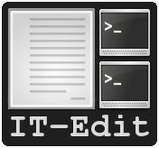

====================================
it-edit (Integrated Terminal Editor)
====================================

:program: it-edit

:version: 2.91

:author: Brüggemann Eddie

:contact: <mrcyberfighter@gmail.com>

:license: GPLv3

:website: <http://www.open-source-projects.net/IT-Edit/IT-Edit_presentation.html>

------------------------------
Motivation for writing it-edit
------------------------------

  They are 2 sort of programmers in their habits of writing programs:

    * They which use an IDE with full integrated functionalities.

    * They which use an text editor to write their programs and a terminal to compile, debug or launch them and some other tools separately.

  Because i'am an programmer from the second category and because i remark that i often use an additional other tools.

  I decide to write my own text editor program which provide me all the functionalities that i need to get a development environment fully adapt to my requirement.

  Which consist of a terminal integrated text-editor with which you can access all you require directly from the editor: documentation, GUI applications, ...

--------------------
it-edit presentation
--------------------

  **it-edit** provide a text editor with ``syntax highlight``, ``line numbering`` and with the basics text editing functionalities:

    * Cut, Copy and Paste.

    * Duplicate a line or the selected text.

    * Undo/Redo functionalities.

    * Search and replace functionalities.

    * Jump to the given line number.

    * Enable | Disable the use of tabs.

  And an files managing interface for:

    * Open a new empty file.

    * Open the file you want.

    * Open an recent file.

    * Save the editor content.

    * Save the editor content as the filename you want.

    * Save all open files.

    * Reload file.

    * File informations.

  **it-edit** provide **terminals in the same window as the editor**, as a sidebar, which can easily **shown**, **hidden** and **resized**.

  You can **add** and **remove** as many terminals as you want to the sidebar...

  **it-edit** provide a **big terminal** occupying the full interface, **dividable** into **4 resizable terminals**, to which you can **easy toggle** from the main window.

  For executing commands like compilation, debugging, and so soon directly from the editor.

  |

  I intend to implement an ``manpages reading interface``, in an **toplevel terminal window** (so it can be **resize**, **minimize**, **maximize** and **closed**),

    but i remark by implementing it that i restrict the command to execute the ``man [section] page`` command.

  So i decide to provide the same functionality but without restricting it to the manpage displaying, to expand it to execute any command you want in an toplevel terminal.

  It result in a functionality to execute a command in a toplevel terminal, which can be resize, minimize, maximize and close.

  After the execution of the command the toplevel terminal is yours and can continue to enter commands...

  |

  I intend to implement launching of ``registered offline HTML documentation`` in a toplevel window,

    but i remark by implementing it that i restrict it to offline **HTML** pages.

  So i decide to provide the same functionality with registering any file you like.

  The registered files are launched with the default program for this filetype.

  After registering the files, you can easy launch it and access them all directly from **it-edit**.

  |

  I want to launch necessary **GUI tools** directly from the editor.

  So **it-edit** permit to register the application you want to get direct access to it from your editor.

  Like: A **GUI** ``diff tool``, A **GUI** ``debugger``, a smart ``python interpreter``, a ``calculator``, a ``color picker``, a ``dictionary``, and so soon...

  |

-----
Files
-----

    You can start **it-edit** from the command line with a space delimited files list, as argument, which will be opened in the editor at start.

    Use the **it-edit** icon to open **it-edit** or with your files-manager you can select files to open with **it-edit**.

    To know for files managing:

        + **Open a new empty file** use the menu item, the button or the shortcut: **Ctrl + n**.

        + **Open a file** by selecting it with a file selector, use the menu item, the button or the shortcut: **Ctrl + o**.

        + You can **open a recent file** by selecting it in the list from the menu item.

        + **Save** the current editor content use the menu item, the button or the shortcut: **Ctrl + s**.

        + **Save all** open files use the menu item, the button or the shortcut: **Ctrl + Maj + S**.

        + **Reload file** will reload the last saved version from the file in the editor, use the menu item or the shortcut **Ctrl + R**.

        + **File informations** will display informations, which you can edit, about the current file, use the menu item or the shortcut **Ctrl + I**.

    You can easily navigate into your open files by using the pop-up menu or by clicking on the file tab.

    You can reorder your open files as wanted by drag and drop the files tabs.

-------
Edition
-------

    To know about edition:

        + **Undo** use the contextual menu or the shortcut: **Ctrl + Z**.

        + **Redo** use the contextual menu or the shortcut: **Ctrl + Maj + Z**.

        + **Cut** use the contextual menu, the menu item, the button or the shortcut: **Ctrl + X**.

        + **Copy** use the contextual menu, the menu item, the button or the shortcut: **Ctrl + C**.

        + **Paste** use the contextual menu, the menu item, the button or the shortcut: **Ctrl + V**.  

        + **Duplicate** the selection or the line at cursor position, use the menu item, the button or the shortcut: **Ctrl + D**.

        + **Use space instead of tabs**: for switching between tab use or not, use the menu item or the shortcut: **Ctrl + P**.

------
Editor
------  

    + **Go to line number** use the menu item, the button or the shortcut: **Ctrl + g**.

      Enter an valid line number and press **Enter** or the **Apply** button to move the editor to the wanted line, which will be highlight.

    + **Find and replace** functionality.

        You can *show* | *hide* the find and replace bar by using the toggle button.

        The search and replace bar has following functionalities:

          + **Search** button: this will highlight all the matching occurrences from the search term and moving the editor to the first occurrence position.
                   
          + **Next** button: highlight the next matching occurrence from the search term.
            
             Pressing **Enter** when the search entry field has the focus has the same effect.
   
             The search will start at selection or at the cursor position.
                       
             If you select some text with the mouse and using the shortcut **Ctrl + f**.
            
             The search field will toggle on if not visible and will contains the selected text as search term.
     
             :note: You can use the shortcut **Ctrl + +** instead of the button (Use the keypad).
     
          
          + **Previous** button: highlight the previous matching occurrence from the search term.
    
             The search will start at selection or at the cursor position.
    
             If you select some text with the mouse and use the shortcut **Ctrl + f**.
            
             The search field will toggle on if not visible and will contains the selected text as search term.
     
             :note: You can use the shortcut **Ctrl + -** instead of the button (Use the keypad).
 
          + **Replace** button: replace the current matching occurrence, which is highlight, with the content of the replace field.
    
             If this don't work simply hit the Next or Previous button, this occur if you never make a search before: a search must be done before replacing.
     
             :note: You can use the shortcut **Ctrl + Enter** instead of the button  (Use the keypad).
                       
          + **Replace all** button: replace all the matching occurrence in the current file.
    
            :note: You can use the shortcut **Ctrl + Maj + Enter** instead of the button  (Use the keypad).
 
          + **Mode**: You can select how your search term(s) will be interpreted.
          
            + **Raw text**: all search terms matching.
          
            + **Word boundary**: The search term must be a complete word, not a part but an variable with separators like underscores or points will work too.
       
            + **Regular expression**: *Perl* compatible regular expression (REGEX).
           
          + **Close** button: hide the search and replace bar and clear the highlight.                
                                                 

        :note: if you select some text with the mouse and use the **Ctrl + f** shortcut.

          * The search and replace bar will be show.
 
          * The search field will be filled with your selection.
 
          * The search will begin at your selection position if you hit the **Next** or **Previous** button.
  
  
            

-------
Actions
-------

    + **Command execution**: use the menu item, the **Cmd** button or the shortcut: **Ctrl + e**.

        This will display a little toplevel in which you can enter a command.

        Then press the **Enter** key or the **Apply** button to execute the command in a terminal include in a toplevel window (so you can resize, minimize, maximize and close the window).

        After the execution from the command the toplevel terminal is yours so can continue to enter commands and use it.

    + **Sidebar Terminals adding**: You can add some terminals, 2 per item, to the sidebar, reorder them, and remove it.
                            
                                    Use the menu item or the shortcut **Ctrl + Maj + T**.  

    + **Big terminal(s) switch**: You can switch between a very big terminal and a very big terminal divided into 4 terminals.
                            
                                    Use the menu item or the shortcut **Ctrl + Maj + B**.

    + **File Handler**: use the menu item or the shortcut: **Ctrl + H**.

        For using this features you must register files from the **Files handler manager** tab interface reachable through the settings->Configure program menu item.

        For registering a file you must give it a title which will appears as the button text in the **File Handler** window and selecting the corresponding file.

        Then when you press the button in the **File Handler** window, the file will be launched with the default application for this filetype.

        This features was thinking for fast access to offline HTML documentation but it's being expanded to any filetype, so you can consult pdf documentation too, but not only, this features can be use for any use you want.

        The registered files can be removed from the **File handler** list through the same interface with which you add it.

    + **Application launcher**: use the menu item or the shortcut: **Ctrl + A**.

        This will display an application chooser. By selecting an application you will launch it.

------------
Applications
------------

    You can set different GUI tools launcher from **it-edit**:

    Under the section **programming** you can set:

        + A **GUI** diff tool.

        + A **GUI** debugger.

        + A **GUI** smart python interpreter.

        + A user interface designer.

        + devhelp.

    Under the **utilities** section you can set:

        + A **GUI** calculator.

        + A **GUI** color picker.

        + A **GUI** dictionary.
  
        + A file manager.

        + A **GUI** note taker.

        + A browser.

    Else you can register the application you want under the **others** section.

    This is very practice to launch an application directly from **it-edit** instead of:

        1. Minimize **it-edit**

        2. Go to the menu.

        3. Find the application you want to launch.

        4. Launch your application. 

----
View
----

    + **Big term** *Show* | *hide*: use the menu item, the toggle button or the shortcut: **Ctrl + B**.

    + **Terminals** *show* | *hide*: use the menu item, the toggle button or the shortcut: **Ctrl + T**.

    + **Button bar** *show* | *hide*: use the menu item.

    + **Fullscreen** toggle: use the menu item.

--------
Settings
--------

    + **Syntax highlight**: use the menu item.

        To set the syntax highlight on, on the current edited text from the supported language.

    + **Editor schemes**: use the menu item.

        To set the appearance from the text editor.

        Currently they are 13 different schemes available in **it-edit**:
  
          + build
  
          + Classic.
   
          + Cobalt.
   
          + emacs.
   
          + Kate (default).
  
          + matrix
   
          + Oblivion.
  
          + slate.
   
          + Solarized-dark.
   
          + Solarized-light.
   
          + Tango.          
  
          + turbo.
  
          + vsdark.
  
        Each time you change the scheme your choice is registered so that you don't have to change it every time you start **it-edit**.

    + **Configure program**: use the menu item.

        To access to the program configuration window which is divide into 3 part:

        + **Editor settings**:

            + Font (Monospace 10 per default).
   
            + Display lines numbers (Enabled per default).
   
            + Display TABS characters (Enabled per default).
   
            + Use auto-indent (Enabled per default).
   
            + Indent width (2 per default).
   
            + Use spaces instead of TABS (Enabled per default).
   
            + TABS width (2 per default).
   
            + Create a backup file by saving (Enabled per default).
    
            + Remove trailing space at saving (Enabled per default).
    
        + **Terminal settings**:
    
            + Appearance:
    
                + Font (Monospace 10 per default).
       
                + Font scale (1.0 per default).
              
                + Cursor type (BLOCK per default).
              
                + Cursor color (white per default).
              
                + Cursor blink mode (BLINK_SYSTEM per default).
              
                + Background color (Black per default).
       
                + Foreground color (White per default).
              
                + Allow bold (True per default).
              
                + Bold color (White per default).
              
                + Pointer autohide (Disabled per default).
              
            + Settings:
    
                + User shell (Default to your default shell).
        
                + Start directory when you launch a terminal.
        
                + Audible bell (Enabled per default).
        
                + Scroll back lines.
        
                    + Unlimited (Default).
            
                    + Settable to the value you want.
            
                + Scrolling.
        
                    + Scroll on output (Disabled per default).
             
                        Controls whether or not the terminal will forcibly scroll to the bottom of the terminal when the new data is received.
             
                    + Scroll on keystroke (Enabled per default).
             
                        Controls whether or not the terminal will forcibly scroll to the bottom of the terminal when the user presses a key.
             
                + Erase binding.
        
                    + Backspace key binding (Default to automatic).
            
                    + Delete key binding (Default to automatic).
                 
        + **File handler manager**:

            Here you can add and remove files for the **File handler** feature.
    
        + **Applications**:

            Here you can define shortcuts for the applications you want.
    
        + **Settings**
    
          + Define the ratio main-interface and sidebar in form of a floating-point value between 0.0-1.0,

            representing the surface the sidebar will cover and so the width of the sidebar terminals.
       
          + Show | hide the sidebar terminals at start.
     
          + Show | hide the big terminal at start.
      
          + Choosing to divide the big terminal in 4 at start.
      
          + Toggle to fullscreen at start.
     
          + Launch a command in the terminals at start.
     
          + Set it-edit as your default editor or reset the settings.
       
--------------
Shortcuts memo
--------------

Application shortcuts:
~~~~~~~~~~~~~~~~~~~~~~

  +--------------------+----------------------+------------------+
  |    Shortcut        |    functionality     |    Mnemonic      |
  +====================+======================+==================+
  | Ctrl + n           | New file             | n = new          |
  +--------------------+----------------------+------------------+
  | Ctrl + o           | Open file            | o = open         |
  +--------------------+----------------------+------------------+
  | Ctrl + s           | Save file            | s = save         |
  +--------------------+----------------------+------------------+
  | Ctrl + Maj + S     | Save all files       | S = Save         |
  +--------------------+----------------------+------------------+
  | Ctrl + r           | Reload file          | r = reload       |
  +--------------------+----------------------+------------------+
  | Ctrl + i           | File informations    | i = Informations |
  +--------------------+----------------------+------------------+
  | Ctrl + z           | Undo                 | None             |
  +--------------------+----------------------+------------------+
  | Ctrl + Maj + Z     | Redo                 | None             |
  +--------------------+----------------------+------------------+
  | Ctrl + f           | Search               | f = find         |
  +--------------------+----------------------+------------------+
  | Ctrl + Enter       | Replace              | none             |
  +--------------------+----------------------+------------------+
  | Ctrl + Maj + Enter | Replace all          | none             |
  +--------------------+----------------------+------------------+
  | Ctrl + +           | Next                 | none             |
  +--------------------+----------------------+------------------+
  | Ctrl + -           | Previous             | none             |
  +--------------------+----------------------+------------------+
  | Ctrl + g           | Go to line number    | g = go to        |
  +--------------------+----------------------+------------------+
  | Ctrl + x           | Cut                  | None             |
  +--------------------+----------------------+------------------+
  | Ctrl + c           | Copy                 | c = copy         |
  +--------------------+----------------------+------------------+
  | Ctrl + v           | Paste                | None             |
  +--------------------+----------------------+------------------+
  | Ctrl + d           | Duplicate text       | d = duplicate    |
  +--------------------+----------------------+------------------+
  | Ctrl + p           | Use tabs             | none             |
  +--------------------+----------------------+------------------+
  | Ctrl + e           | Execute command      | e = execute      |
  +--------------------+----------------------+------------------+
  | Ctrl + b           | Show|Hide big term   | b = big term     |
  +--------------------+----------------------+------------------+
  | Ctrl + Maj + B     | big term switch      | B = Big term     |
  +--------------------+----------------------+------------------+
  | Ctrl + t           | Show | Hide terminal | t = terminal     |
  +--------------------+----------------------+------------------+
  | Ctrl + Maj + T     | Add new terminals    | T = Terminals    |
  +--------------------+----------------------+------------------+
  | Maj + Copy         | Copy from terminal   | none             |
  +--------------------+----------------------+------------------+
  | Maj + Insert       | Paste to terminal    | none             |
  +--------------------+----------------------+------------------+
  | Ctrl + h           | File handler         | h = handler      |
  +--------------------+----------------------+------------------+
  | Ctrl + a           | Application launcher | a = application  |
  +--------------------+----------------------+------------------+
  | Ctrl + q           | Quit application     | q = quit         |
  +--------------------+----------------------+------------------+

Terminals shortcuts:
~~~~~~~~~~~~~~~~~~~~

  +-----------------------+----------------------+------------------+
  |    Shortcut           |    functionality     |    Mnemonic      |
  +=======================+======================+==================+
  | Shift + Copy (KP 1)   | Copy from terminal   | none             |
  +-----------------------+----------------------+------------------+
  | Shift + Insert (KP 0) | Paste to terminal    | none             |
  +-----------------------+----------------------+------------------+
  | Shift + Ctrl + T      | Open new tab         | t = tab          |
  +-----------------------+----------------------+------------------+
  | Shift + Ctrl + -      | Decrease font-scale  | \- = decrease    |
  +-----------------------+----------------------+------------------+
  | Shift + Ctrl + +      | Increase font-scale  | \+ = increase    |
  +-----------------------+----------------------+------------------+

  :note: Else you can close a tab and reset the terminal from the terminals contextual menu.

-------------------
Supported languages
-------------------

+ **ActionScript** (text/x-actionscript)

  + *\*.as*

+ **Ada** (text/x-ada, text/x-adasrc)

  + *\*.adb*
  + *\*.ads*

+ **ANS-Forth94** (text/x-forth)

  + *\*.4th*
  + *\*.forth*

+ **ASP** (text/x-asp, application/x-asp, application/x-asap)

  + *\*.asp*

+ **Automake**

  + *Makefile.am*
  + *GNUmakefile.am*

+ **awk** (application/x-awk)

  + *\*.awk*

+ **BennuGD**

  + *\*.prg*

+ **BibTeX** (text/x-bibtex)

  + *\*.bib*

+ **Boo** (text/x-boo)

  + *\*.boo*

+ **C** (text/x-c, text/x-csrc, image/x-xpixmap)

  + *\*.c*

+ **C#** (text/x-csharpsrc, text/x-csharp)

  + *\*.cs*

+ **C++** (text/x-c++, text/x-cpp, text/x-c++src)

  + *\*.cpp*
  + *\*.cxx*
  + *\*.cc*
  + *\*.C*
  + *\*.c++*

+ **ChangeLog** (text/x-changelog)

  + ChangeLog

+ **C++** **Header** (text/x-c++hdr)

  + *\*.hh*
  + *\*.hp*
  + *\*.hpp*
  + *\*.h++*

+ **C/C++/ObjC** **Header** (text/x-chdr)

  + *\*.h*

+ **CG Shader Language**

  + *\*.cg*

+ **CMake**

  + *CMakeLists.txt*
  + *\*.cmake*
  + *\*.cmake.in*
  + *\*.ctest*
  + *\*.ctest.in*

+ **COBOL**

  + *\*.cbl*
  + *\*.cob*
  + *\*.cbd*
  + *\*.cdb*
  + *\*.cdc*

+ **CSS** (text/css)

  + *\*.css*
  + *\*.CSSL*

+ **CSV** (text/csv)

  + *\*.csv*

+ **CUDA**

  + *\*.cu*
  + *\*.cuh*

+ **D** (text/x-dsrc)

  + *\*.d*

+ **.desktop** (application/x-gnome-app-info, application/x-desktop)

  + *\*.desktop*
  + *\*.kdelnk*

+ **Diff** (text/x-diff, text/x-patch, text/x-reject)

  + *\*.diff*
  + *\*.patch*
  + *\*.rej*

+ **DocBook** (application/docbook+xml)

  + *\*.docbook*

+ **DOS Batch**

  + *\*.bat*
  + *\*.cmd*
  + *\*.sys*

+ **DPatch** (text/x-dpatch)

  + *\*.dpatch*

+ **DTD** (text/x-dtd)

  + *\*.dtd*

+ **Eiffel** (text/x-eiffel)

  + *\*.e*
  + *\*.eif*

+ **Erlang** (text/x-erlang)

  + *\*.erl*
  + *\*.hrl*

+ **F#** (text/x-fsharp)

  + *\*.fs*

+ **FCL**

  + *\*.fcl*

+ **Forth** (text/x-forth)

  + *\*.frt*
  + *\*.fs*

+ **Fortran 95** (text/x-fortran)

  + *\*.f*
  + *\*.f90*
  + *\*.f95*
  + *\*.for*
  + *\*.F*
  + *\*.F90*

+ **GAP** (text/x-gap)

  + *\*.g*
  + *\*.gd*
  + *\*.gi*
  + *\*.gap*

+ **GDB Log**

  + *\*.gdb*

+ **Genie** (text/x-genie)

  + *\*.gs*

+ **gettext translation** (text/x-po, text/x-pot, text/x-pox, text/x-gettext-translation, text/x-gettext-translation-template)

  + *\*.po*
  + *\*.pot*

+ **Go**

  + *\*.go*

+ **Graphviz Dot** (text/vnd.graphviz)

  + *\*.dot*
  + *\*.gv*

+ **gtk-doc**

+ **GtkRC** (text/x-gtkrc)

  + gtkrc
  + *\*.gtkrc*
  + *gtkrc-\**
  + *\*.gtkrc-\**

+ **Haddock**

+ **Haskell** (text/x-haskell)

  + *\*.hs*

+ **HTML** (text/html)

  + *\*.html*
  + *\*.htm*

+ **IDL** (text/x-idl)

  + *\*.idl*

+ **IDL-Exelis**

  + *\*.pro*

+ **ImageJ**

  + *\*.ijm*

+ **.ini** (text/x-ini-file, application/x-ini-file)

  + *\*.ini*

+ **J**

  + *\*.ijs*

+ **Jade**

  + *\*.jade*

+ **Java** (text/x-java)

  + *\*.java*

+ **JavaScript** (application/javascript, application/x-javascript, text/x-javascript, text/javascript, text/x-js)

  + *\*.js*
  + *\*.node*

+ **JSON** (application/json)

  + *\*.json*
  + *\*.geojson*
  + *\*.topojson*

+ **Julia**

  + *\*.jl*

+ **LaTeX** (text/x-tex)

  + *\*.tex*
  + *\*.ltx*
  + *\*.sty*
  + *\*.cls*
  + *\*.dtx*
  + *\*.ins*
  + *\*.bbl*

+ **Lex**

  + *\*.l*
  + *\*.lex*
  + *\*.flex*

+ **libtool** (text/x-libtool)

  + *\*.la*
  + *\*.lai*
  + *\*.lo*

+ **Literate Haskell** (text/x-literate-haskell)

  + *\*.lhs*

+ **LLVM IR**

  + *\*.ll*

+ **Lua** (text/x-lua)

  + *\*.lua*

+ **m4** (application/x-m4)

  + *\*.m4*
  + *configure.ac*
  + *configure.in*

+ **Makefile** (text/x-makefile)

  + *[Mm]akefile*
  + *GNUmakefile*
  + *\*.make*
  + *\*.mak*
  + *\*.mk*

+ **Mallard**

  + *\*.page*

+ **Markdown** (text/x-markdown)

  + *\*.markdown*
  + *\*.md*
  + *\*.mkd*

+ **Matlab** (text/x-matlab)

  + *\*.m*

+ **MediaWiki**

+ **Meson** (text/x-meson)

  + *meson.build*
  + *meson_options.txt*

+ **ML standard**

  + *\*.sml*
  + *\*.sig*

+ **Modelica** (text/x-modelica)

  + *\*.mo*
  + *\*.mop*

+ **MXML**

  + *\*.mxml*

+ **Nemerle** (text/x-nemerle)

  + *\*.n*

+ **NetRexx** (text/x-netrexx)

  + *\*.nrx*

+ **NSIS**

  + *\*.nsi*
  + *\*.nsh*

+ **Objective-C** (text/x-objcsrc)

  + *\*.m*

+ **Objective-J** (text/x-objective-j)

  + *\*.j*

+ **OCaml** (text/x-ocaml)

  + *\*.ml*
  + *\*.mli*
  + *\*.mll*
  + *\*.mly*

+ **OCL** (text/x-ocl)

  + *\*.ocl*

+ **Octave** (text/x-octave)

  + *\*.m*

+ **OOC**

  + *\*.ooc*

+ **Opal**

  + *\*.sign*
  + *\*.impl*

+ **OpenCL**

  + *\*.cl*

+ **OpenGL Shading Language**

  + *\*.glslv*
  + *\*.glslf*

+ **Pascal** (text/x-pascal)

  + *\*.p*
  + *\*.pas*

+ **Perl** (text/x-perl, application/x-perl)

  + *\*.pl*
  + *\*.pm*
  + *\*.al*
  + *\*.perl*
  + *\*.t*

+ **PHP** (text/x-php, application/x-php, text/x-php-source, application/x-php-source)

  + *\*.php*
  + *\*.php3*
  + *\*.php4*
  + *\*.phtml*

+ **Pig**

  + *\*.pig*

+ **pkg-config** (text/x-pkg-config)

  + *\*.pc*

+ **Prolog** (text/x-prolog)

  + *\*.prolog*

+ **Protobuf** (text/x-protobuf)

  + *\*.proto*

+ **Puppet**

  + *\*.pp*

+ **Python** (text/x-python, application/x-python)

  + *\*.py*

+ **Python 3**

  + *\*.py3*

+ **R** (text/x-R)

  + *\*.R*
  + *\*.Rout*
  + *\*.r*
  + *\*.Rhistory*
  + *\*.Rt*
  + *\*.Rout.save*
  + *\*.Rout.fail*

+ **reStructuredText** (text/x-rst)

  + *\*.rst*

+ **Ruby** (application/x-ruby, text/x-ruby)

  + *\*.rb*
  + *\*.rake*
  + *\*.gemspec*
  + *Rakefile*
  + *Capfile*
  + *Gemfile*

+ **Rust**

  + *\*.rs*

+ **Scala** (text/x-scala)

  + *\*.scala*

+ **Scheme** (text/x-scheme)

  + *\*.scm*

+ **Scilab**

  + *\*.sce*
  + *\*.sci*

+ **sh** (text/x-shellscript, application/x-shellscript, text/x-sh)

  + *\*.sh*
  + *\*bashrc*
  + *.profile*
  + *.bash_profile*

+ **SPARQL** (application/sparql-query)

  + *\*.rq*

+ **Specification RPM** (text/x-rpm-spec)

  + *\*.spec*

+ **SQL** (text/x-sql)

  + *\*.sql*

+ **Sweave**

  + *\*.rnw*
  + *\*.Rnw*
  + *\*.snw*
  + *\*.Snw*

+ **SystemVerilog**

  + *\*.sv*
  + *\*.svh*

+ **SystemVerilog Bluespec**

  + *\*.bsv*

+ **Tcl** (text/x-tcl, application/x-tcl)

  + *\*.tcl*
  + *\*.tk*

+ **Texinfo** (text/x-texinfo)

  + *\*.texi*
  + *\*.texinfo*

+ **Thrift**

  + *\*.thrift*

+ **txt2tags**

  + *\*.t2t*

+ **Vala** (text/x-vala)

  + *\*.vala*
  + *\*.vapi*

+ **VB.NET** (text/x-vbnet, text/x-vb)

  + *\*.vb*

+ **Verilog** (text/x-verilog-src)

  + *\*.v*

+ **VHDL** (text/x-vhdl)

  + *\*.vhd*

+ **XML** (application/xml, text/xml)

  + *\*.xml*
  + *\*.xspf*
  + *\*.siv*
  + *\*.smil*
  + *\*.smi*
  + *\*.sml*
  + *\*.kino*
  + *\*.xul*
  + *\*.xbel*
  + *\*.abw*
  + *\*.zabw*
  + *\*.glade*
  + *\*.jnlp*
  + *\*.xhtml*
  + *\*.svg*
  + *\*.mml*
  + *\*.rdf*
  + *\*.rss*
  + *\*.wml*
  + *\*.xmi*
  + *\*.fo*
  + *\*.xslfo*

+ **XSLT** (application/xslt+xml)

  + *\*.xslt*
  + *\*.xsl*

+ **Yacc** (text/x-yacc, text/x-bison)

  + *\*.y*
  + *\*.yacc*

+ **YAML** (application/x-yaml)

  + *\*.yaml*
  + *\*.yml*

-------
Credits
-------

    :Author: Eddie Brüggemann

    :Contact: <mrcyberfighter@gmail.com>

    :License: GPLv3.

    Thank's to my beloved mother, my family and to the doctors.

    Stay away from drugs: drugs destroy your brain and your life.
